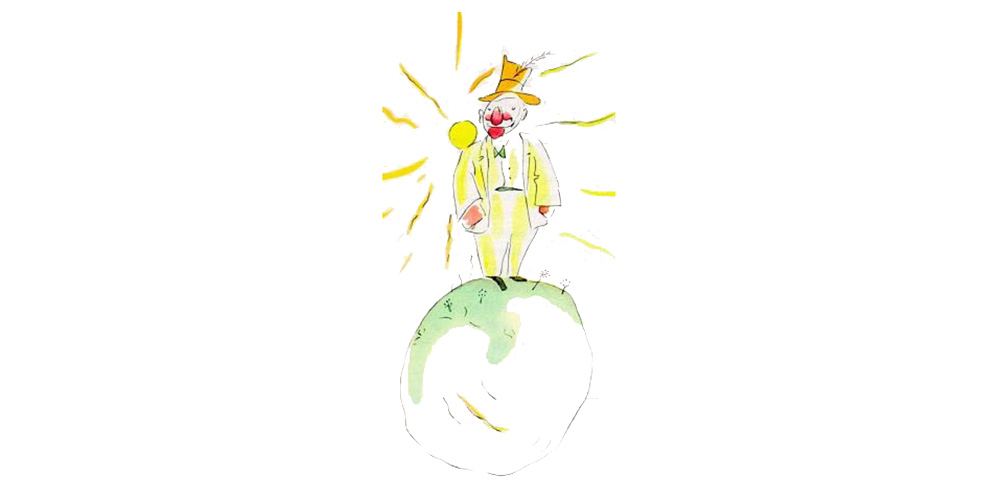

# Chapter 11

The second planet was inhabited by a conceited man.

"Ah! Ah! I am about to receive a visit from an admirer!" he exclaimed from afar, when he first saw the little prince coming.

For, to conceited men, all other men are admirers.

"Good morning," said the little prince. "That is a queer hat you are wearing."

"It is a hat for salutes," the conceited man replied. "It is to raise in salute when people acclaim me. Unfortunately, nobody at all ever passes this way."

"Yes?" said the little prince, who did not understand what the conceited man was talking about.

"Clap your hands, one against the other," the conceited man now directed him.

The little prince clapped his hands. The conceited man raised his hat in a modest salute.

"This is more entertaining than the visit to the king," the little prince said to himself. And he began again to clap his hands, one against the other. The conceited man against raised his hat in salute.

After five minutes of this exercise the little prince grew tired of the game's monotony.

"And what should one do to make the hat come down?" he asked.

But the conceited man did not hear him. Conceited people never hear anything but praise.

"Do you really admire me very much?" he demanded of the little prince.

"What does that mean−− 'admire'?"

"To admire mean that you regard me as the handsomest, the best−dressed, the richest, and the most intelligent man on this planet."

"But you are the only man on your planet!"

"Do me this kindness. Admire me just the same."

"I admire you," said the little prince, shrugging his shoulders slightly, "but what is there in that to interest you so much?"

And the little prince went away.

"The grown−ups are certainly very odd," he said to himself, as he continued on his journey.