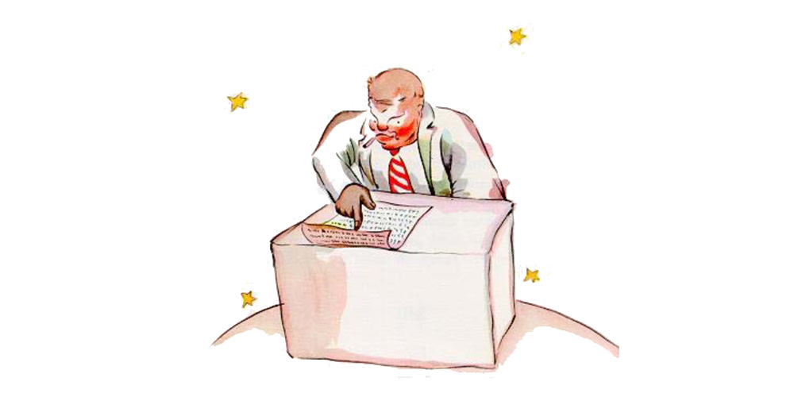

# Chapter 12

The fourth planet belonged to a businessman. This man was so much occupied that he did not even raise his head at the little prince's arrival.

"Good morning," the little prince said to him. "Your cigarette has gone out."

"Three and two make five. Five and seven make twelve. Twelve and three make fifteen. Good morning. Fifteen and seven make twenty−two. Twenty−two and six make twenty−eight. I haven't time to light it again. Twenty−six and five make thirty−one. Phew! Then that makes five−hundred−and−one−million, six−hundred−twenty−two−thousand, seven−hundred−thirty−one."

"Five hundred million what?" asked the little prince.

"Eh? Are you still there? Five−hundred−and−one million−− I can't stop... I have so much to do! I am concerned with matters of consequence. I don't amuse myself with balderdash. Two and five make seven..."

"Five−hundred−and−one million what?" repeated the little prince, who never in his life had let go of a question once he had asked it.

The businessman raised his head.

"During the fifty−four years that I have inhabited this planet, I have been disturbed only three times. The first time was twenty−two years ago, when some giddy goose fell from goodness knows where. He made the most frightful noise that resounded all over the place, and I made four mistakes in my addition. The second time, eleven years ago, I was disturbed by an attack of rheumatism. I don't get enough exercise. I have no time for loafing. The third time−− well, this is it! I was saying, then, five −hundred−and−one millions−−"

"Millions of what?"

The businessman suddenly realized that there was no hope of being left in peace until he answered this question.

"Millions of those little objects," he said, "which one sometimes sees in the sky."

"Flies?"

"Oh, no. Little glittering objects."

"Bees?"

"Oh, no. Little golden objects that set lazy men to idle dreaming. As for me, I am concerned with matters of consequence. There is no time for idle dreaming in my life."

"Ah! You mean the stars?"

"Yes, that's it. The stars."

"And what do you do with five−hundred millions of stars?"

"Five−hundred−and−one million, six−hundred−twenty−two thousand, seven−hundred−thirty−one. I am concerned with matters of consequence: I am accurate."

"And what do you do with these stars?"

"What do I do with them?"

"Yes."

"Nothing. I own them."

"You own the stars?"

"Yes."

"But I have already seen a king who−−"

"Kings do not own, they reign over. It is a very different matter."

"And what good does it do you to own the stars?"

"It does me the good of making me rich."

"And what good does it do you to be rich?"

"It makes it possible for me to buy more stars, if any are ever discovered."

"This man," the little prince said to himself, "reasons a little like my poor tippler..."

Nevertheless, he still had some more questions.

"How is it possible for one to own the stars?"

"To whom do they belong?" the businessman retorted, peevishly.

"I don't know. To nobody."

"Then they belong to me, because I was the first person to think of it."

"Is that all that is necessary?"

"Certainly. When you find a diamond that belongs to nobody, it is yours. When you discover an island that belongs to nobody, it is yours. When you get an idea before any one else, you take out a patent on it: it is yours. So with me: I own the stars, because nobody else before me ever thought of owning them."

"Yes, that is true," said the little prince. "And what do you do with them?"

"I administer them," replied the businessman. "I count them and recount them. It is difficult. But I am a man who is naturally interested in matters of consequence."

The little prince was still not satisfied.

"If I owned a silk scarf," he said, "I could put it around my neck and take it away with me. If I owned a flower, I could pluck that flower and take it away with me. But you cannot pluck the stars from heaven..."

"No. But I can put them in the bank."

"Whatever does that mean?"

"That means that I write the number of my stars on a little paper. And then I put this paper in a drawer and lock it with a key."

"And that is all?"

"That is enough," said the businessman.

"It is entertaining," thought the little prince. "It is rather poetic. But it is of no great consequence."

On matters of consequence, the little prince had ideas which were very different from those of the grown−ups.

"I myself own a flower," he continued his conversation with the businessman, "which I water every day. I own three volcanoes, which I clean out every week (for I also clean out the one that is extinct; one never knows). It is of some use to my volcanoes, and it is of some use to my flower, that I own them. But you are of no use to the stars..."

The businessman opened his mouth, but he found nothing to say in answer. And the little prince went away.

"The grown−ups are certainly altogether extraordinary," he said simply, talking to himself as he continued on his journey.