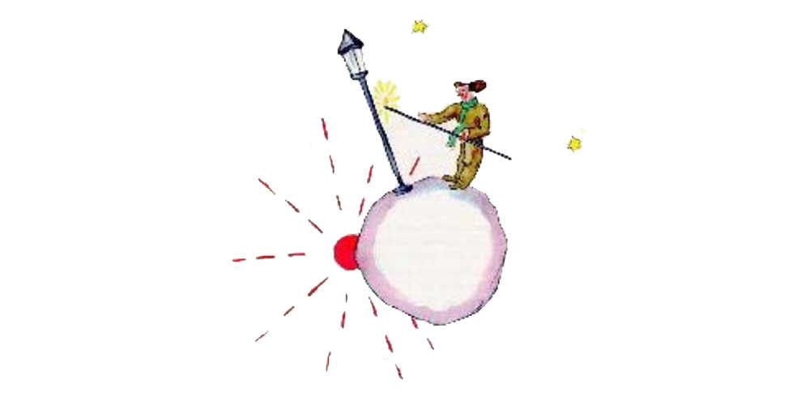

# Chapter 14

The fifth planet was very strange. It was the smallest of all. There was just enough room on it for a street lamp and a lamplighter. The little prince was not able to reach any explanation of the use of a street lamp and a lamplighter, somewhere in the heavens, on a planet which had no people, and not one house. But he said to himself, nevertheless:

"It may well be that this man is absurd. But he is not so absurd as the king, the conceited man, the businessman, and the tippler. For at least his work has some meaning. When he lights his street lamp, it is as if he brought one more star to life, or one flower. When he puts out his lamp, he sends the flower, or the star, to sleep. That is a beautiful occupation. And since it is beautiful, it is truly useful."

When he arrived on the planet he respectfully saluted the lamplighter.

"Good morning. Why have you just put out your lamp?"

"Those are the orders," replied the lamplighter. "Good morning."

"What are the orders?"

"The orders are that I put out my lamp. Good evening."

And he lighted his lamp again.

"But why have you just lighted it again?"

"Those are the orders," replied the lamplighter.

"I do not understand," said the little prince.

"There is nothing to understand," said the lamplighter. "Orders are orders. Good morning."

And he put out his lamp.

Then he mopped his forehead with a handkerchief decorated with red squares.

"I follow a terrible profession. In the old days it was reasonable. I put the lamp out in the morning, and in the evening I lighted it again. I had the rest of the day for relaxation and the rest of the night for sleep."

"And the orders have been changed since that time?"

"The orders have not been changed," said the lamplighter. "That is the tragedy! From year to year the planet has turned more rapidly and the orders have not been changed!"

"Then what?" asked the little prince.

"Then−− the planet now makes a complete turn every minute, and I no longer have a single second for repose. Once every minute I have to light my lamp and put it out!"

"That is very funny! A day lasts only one minute, here where you live!"

"It is not funny at all!" said the lamplighter. "While we have been talking together a month has gone by."

"A month?"

"Yes, a month. Thirty minutes. Thirty days. Good evening."

And he lighted his lamp again.

As the little prince watched him, he felt that he loved this lamplighter who was so faithful to his orders. He remembered the sunsets which he himself had gone to seek, in other days, merely by pulling up his chair; and he wanted to help his friend.

"You know," he said, "I can tell you a way you can rest whenever you want to..."

"I always want to rest," said the lamplighter.

For it is possible for a man to be faithful and lazy at the same time.

The little prince went on with his explanation:

"Your planet is so small that three strides will take you all the way around it. To be always in the sunshine, you need only walk along rather slowly. When you want to rest, you will walk−− and the day will last as long as you like."

"That doesn't do me much good," said the lamplighter. "The one thing I love in life is to sleep."

"Then you're unlucky," said the little prince.

"I am unlucky," said the lamplighter. "Good morning."

And he put out his lamp.

"That man," said the little prince to himself, as he continued farther on his journey, "that man would be scorned by all the others: by the king, by the conceited man, by the tippler, by the businessman. Nevertheless he is the only one of them all who does not seem to me ridiculous. Perhaps that is because he is thinking of something else besides himself."

He breathed a sigh of regret, and said to himself, again:

"That man is the only one of them all whom I could have made my friend. But his planet is indeed too small. There is no room on it for two people..."

What the little prince did not dare confess was that he was sorry most of all to leave this planet, because it was blest every day with 1440 sunsets!