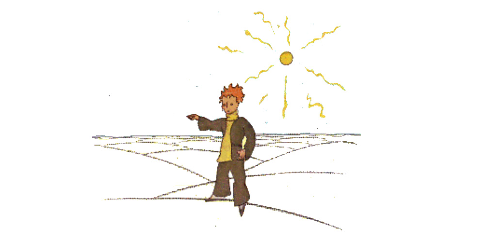

# Chapter 16

So then the seventh planet was the Earth.

The Earth is not just an ordinary planet! One can count, there 111 kings (not forgetting, to be sure, the Negro kings among them), 7000 geographers, 900,000 businessmen, 7,500,000 tipplers, 311,000,000 conceited men−− that is to say, about 2,000,000,000 grown−ups.

To give you an idea of the size of the Earth, I will tell you that before the invention of electricity it was necessary to maintain, over the whole of the six continents, a veritable army of 462,511 lamplighters for the street lamps.

Seen from a slight distance, that would make a splendid spectacle. The movements of this army would be regulated like those of the ballet in the opera. First would come the turn of the lamplighters of New Zealand and Australia. Having set their lamps alight, these would go off to sleep. Next, the lamplighters of China and Siberia would enter for their steps in the dance, and then they too would be waved back into the wings. After that would come the turn of the lamplighters of Russia and the Indies; then those of Africa and Europe, then those of South America; then those of South America; then those of North America. And never would they make a mistake in the order of their entry upon the stage. It would be magnificent.

Only the man who was in charge of the single lamp at the North Pole, and his colleague who was responsible for the single lamp at the South Pole−− only these two would live free from toil and care: they would be busy twice a year.

