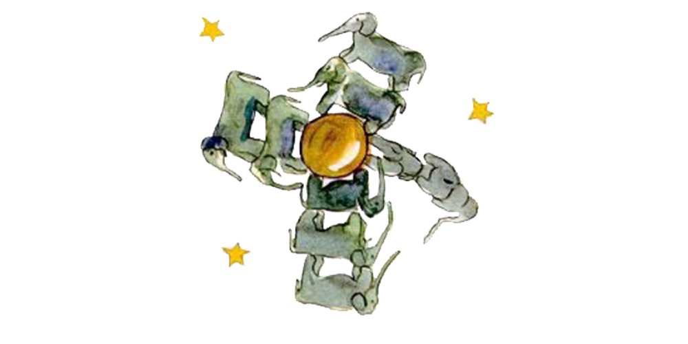
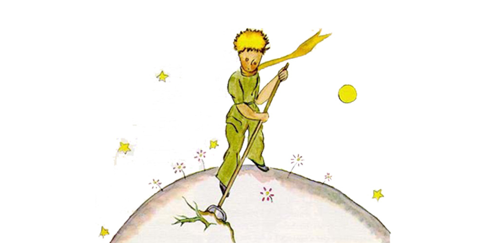
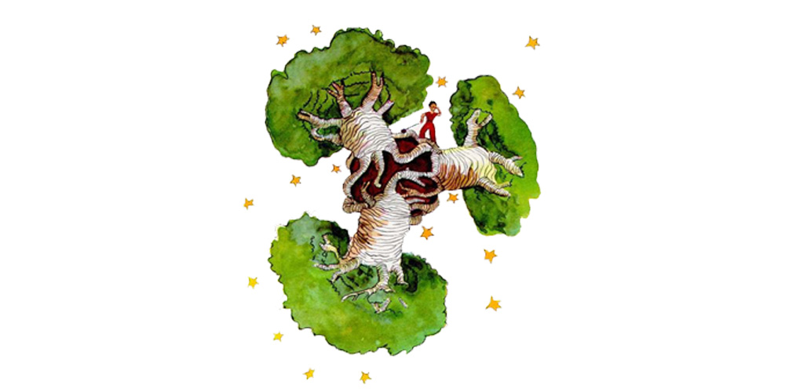

# Chapter 5

As each day passed I would learn, in our talk, something about the little prince's planet, his departure from it, his journey. The information would come very slowly, as it might chance to fall from his thoughts. It was in this way that I heard, on the third day, about the catastrophe of the baobabs. This time, once more, I had the sheep to thank for it. For the little prince asked me abruptly−− as if seized by a grave doubt−− "It is true, isn't it, that sheep eat little bushes?"

"Yes, that is true."

"Ah! I am glad!"

I did not understand why it was so important that sheep should eat little bushes.

But the little prince added:

"Then it follows that they also eat baobabs?"

I pointed out to the little prince that baobabs were not little bushes, but, on the contrary, trees as big as castles; and that even if he took a whole herd of elephants away with him, the herd would not eat up one single baobab.

The idea of the herd of elephants made the little prince laugh.

"We would have to put them one on top of the other," he said.

But he made a wise comment:

"Before they grow so big, the baobabs start out by being little."

"That is strictly correct," I said. "But why do you want the sheep to eat the little baobabs?"

He answered me at once, "Oh, come, come!", as if he were speaking of something that was self−evident. And I was obliged to make a great mental effort to solve this problem, without any assistance.

Indeed, as I learned, there were on the planet where the little prince lived−− as on all planets−− good plants and bad plants. In consequence, there were good seeds from good plants, and bad seeds from bad plants. But seeds are invisible. They sleep deep in the heart of the earth's darkness, until some one among them is seized with the desire to awaken. Then this little seed will stretch itself and begin−− timidly at first−− to push a charming little sprig inoffensively upward toward the sun. If it is only a sprout of radish or the sprig of a rose−bush, one would let it grow wherever it might wish. But when it is a bad plant, one must destroy it as soon as possible, the very first instant that one recognizes it.

Now there were some terrible seeds on the planet that was the home of the little prince; and these were the seeds of the baobab. The soil of that planet was infested with them. A baobab is something you will never, never be able to get rid of if you attend to it too late. It spreads over the entire planet. It bores clear through it with its roots. And if the planet is too small, and the baobabs are too many, they split it in pieces...

"It is a question of discipline," the little prince said to me later on. "When you've finished your own toilet in the morning, then it is time to attend to the toilet of your planet, just so, with the greatest care. You must see to it that you pull up regularly all the baobabs, at the very first moment when they can be distinguished from the rosebushes which they resemble so closely in their earliest youth. It is very tedious work," the little prince added, "but very easy."

And one day he said to me: "You ought to make a beautiful drawing, so that the children where you live can see exactly how all this is. That would be very useful to them if they were to travel some day. Sometimes," he added, "there is no harm in putting off a piece of work until another day. But when it is a matter of baobabs, that always means a catastrophe. I knew a planet that was inhabited by a lazy man. He neglected three little bushes..."

So, as the little prince described it to me, I have made a drawing of that planet. I do not much like to take the tone of a moralist. But the danger of the baobabs is so little understood, and such considerable risks would be run by anyone who might get lost on an asteroid, that for once I am breaking through my reserve. "Children," I say plainly, "watch out for the baobabs!"

My friends, like myself, have been skirting this danger for a long time, without ever knowing it; and so it is for them that I have worked so hard over this drawing. The lesson which I pass on by this means is worth all the trouble it has cost me.

Perhaps you will ask me, "Why are there no other drawing in this book as magnificent and impressive as this drawing of the baobabs?" The reply is simple. I have tried. But with the others I have not been successful. When I made the drawing of the baobabs I was carried beyond myself by the inspiring force of urgent necessity.