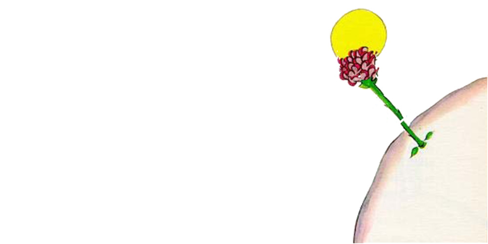

# Chapter 7

On the fifth day−− again, as always, it was thanks to the sheep−− the secret of the little prince's life was revealed to me. Abruptly, without anything to lead up to it, and as if the question had been born of long and silent meditation on his problem, he demanded:

"A sheep−− if it eats little bushes, does it eat flowers, too?"

"A sheep," I answered, "eats anything it finds in its reach."

"Even flowers that have thorns?"

"Yes, even flowers that have thorns."

"Then the thorns−− what use are they?"

I did not know. At that moment I was very busy trying to unscrew a bolt that had got stuck in my engine. I was very much worried, for it was becoming clear to me that the breakdown of my plane was extremely serious. And I had so little drinking−water left that I had to fear for the worst.

"The thorns−− what use are they?"

The little prince never let go of a question, once he had asked it. As for me, I was upset over that bolt. And I answered with the first thing that came into my head:

"The thorns are of no use at all. Flowers have thorns just for spite!"

"Oh!"

There was a moment of complete silence. Then the little prince flashed back at me, with a kind of resentfulness:

"I don't believe you! Flowers are weak creatures. They are naïve. They reassure themselves as best they can. They believe that their thorns are terrible weapons..."

I did not answer. At that instant I was saying to myself: "If this bolt still won't turn, I am going to knock it out with the hammer." Again the little prince disturbed my thoughts.

"And you actually believe that the flowers−−"

"Oh, no!" I cried. "No, no no! I don't believe anything. I answered you with the first thing that came into my head. Don't you see−− I am very busy with matters of consequence!"

He stared at me, thunderstruck.

"Matters of consequence!"

He looked at me there, with my hammer in my hand, my fingers black with engine−grease, bending down over an object which seemed to him extremely ugly...

"You talk just like the grown−ups!"

That made me a little ashamed. But he went on, relentlessly:

"You mix everything up together... You confuse everything..."

He was really very angry. He tossed his golden curls in the breeze.

"I know a planet where there is a certain red−faced gentleman. He has never smelled a flower. He has never looked at a star. He has never loved any one. He has never done anything in his life but add up figures. And all day he says over and over, just like you: 'I am busy with matters of consequence!' And that makes him swell up with pride. But he is not a man−− he is a mushroom!"

"A what?"

"A mushroom!"

The little prince was now white with rage.

"The flowers have been growing thorns for millions of years. For millions of years the sheep have been eating them just the same. And is it not a matter of consequence to try to understand why the flowers go to so much trouble to grow thorns which are never of any use to them? Is the warfare between the sheep and the flowers not important? Is this not of more consequence than a fat red−faced gentleman's sums? And if I know−− I, myself−− one flower which is unique in the world, which grows nowhere but on my planet, but which one little sheep can destroy in a single bite some morning, without even noticing what he is doing−− Oh! You think that is not important!"

His face turned from white to red as he continued:

"If some one loves a flower, of which just one single blossom grows in all the millions and millions of stars, it is enough to make him happy just to look at the stars. He can say to himself, 'Somewhere, my flower is there...' But if the sheep eats the flower, in one moment all his stars will be darkened... And you think that is not important!"

He could not say anything more. His words were choked by sobbing.

The night had fallen. I had let my tools drop from my hands. Of what moment now was my hammer, my bolt, or thirst, or death? On one star, one planet, my planet, the Earth, there was a little prince to be comforted. I took him in my arms, and rocked him. I said to him:

"The flower that you love is not in danger. I will draw you a muzzle for your sheep. I will draw you a railing to put around your flower. I will−−"

I did not know what to say to him. I felt awkward and blundering. I did not know how I could reach him, where I could overtake him and go on hand in hand with him once more.

It is such a secret place, the land of tears.