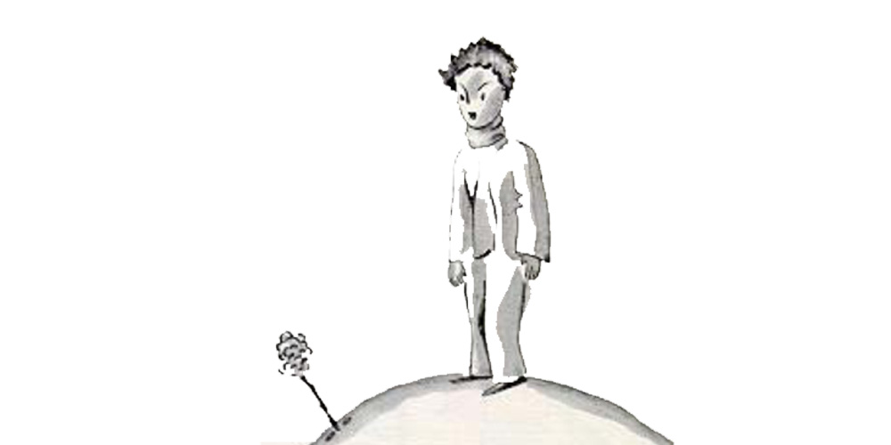
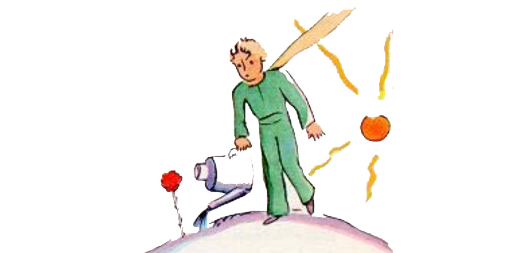
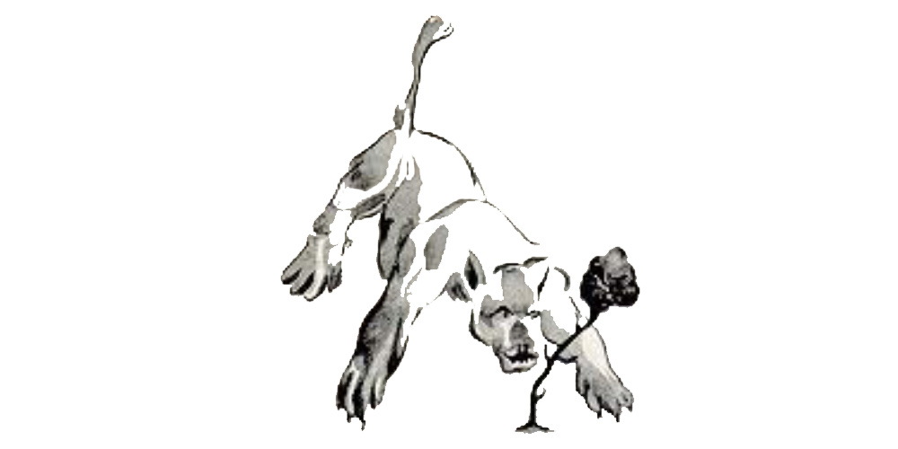
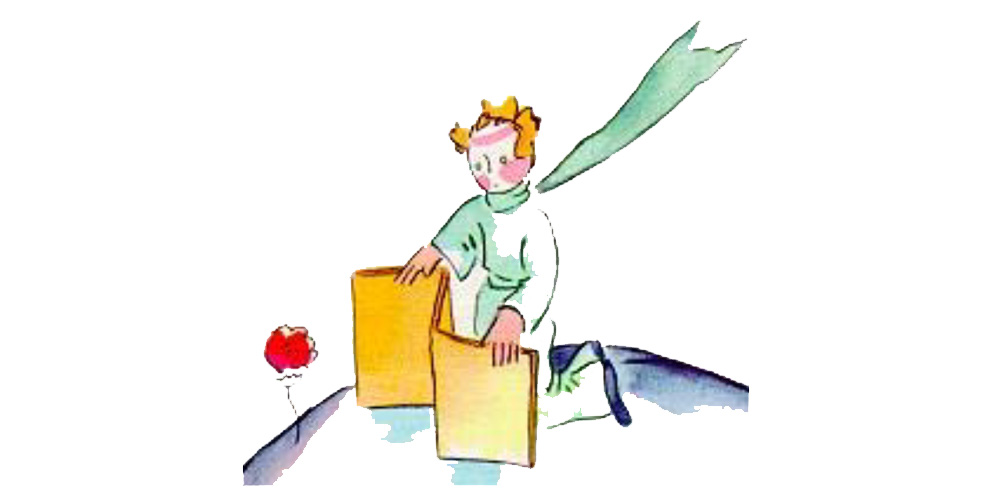
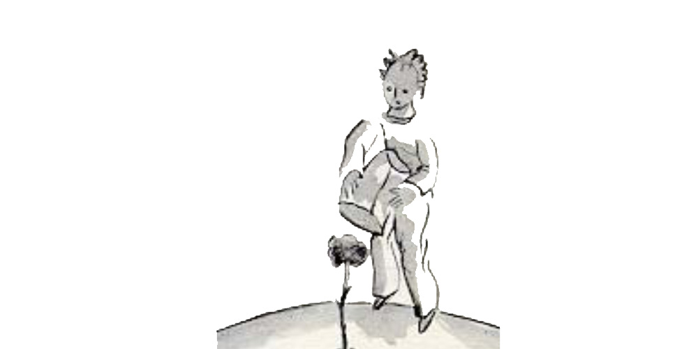

# Chapter 8

I soon learned to know this flower better. On the little prince's planet the flowers had always been very simple. They had only one ring of petals; they took up no room at all; they were a trouble to nobody. One morning they would appear in the grass, and by night they would have faded peacefully away. But one day, from a seed blown from no one knew where, a new flower had come up; and the little prince had watched very closely over this small sprout which was not like any other small sprouts on his planet. It might, you see, have been a new kind of baobab.

The shrub soon stopped growing, and began to get ready to produce a flower. The little prince, who was present at the first appearance of a huge bud, felt at once that some sort of miraculous apparition must emerge from it. But the flower was not satisfied to complete the preparations for her beauty in the shelter of her green chamber. She chose her colours with the greatest care. She adjusted her petals one by one. She did not wish to go out into the world all rumpled, like the field poppies. It was only in the full radiance of her beauty that she wished to appear. Oh, yes! She was a coquettish creature! And her mysterious adornment lasted for days and days.

Then one morning, exactly at sunrise, she suddenly showed herself.

And, after working with all this painstaking precision, she yawned and said:

"Ah! I am scarcely awake. I beg that you will excuse me. My petals are still all disarranged..."

But the little prince could not restrain his admiration:

"Oh! How beautiful you are!"

"Am I not?" the flower responded, sweetly. "And I was born at the same moment as the sun..."

The little prince could guess easily enough that she was not any too modest−− but how moving−− and exciting−− she was!

"I think it is time for breakfast," she added an instant later. "If you would have the kindness to think of my needs−−"

And the little prince, completely abashed, went to look for a sprinkling−can of fresh water. So, he tended the flower.

So, too, she began very quickly to torment him with her vanity−− which was, if the truth be known, a little difficult to deal with. One day, for instance, when she was speaking of her four thorns, she said to the little prince:

"Let the tigers come with their claws!"

"There are no tigers on my planet," the little prince objected. "And, anyway, tigers do not eat weeds."

"I am not a weed," the flower replied, sweetly.

"Please excuse me..."

"I am not at all afraid of tigers," she went on, "but I have a horror of drafts. I suppose you wouldn't have a screen for me?"

"A horror of drafts−− that is bad luck, for a plant," remarked the little prince, and added to himself, "This flower is a very complex creature..."

"At night I want you to put me under a glass globe. It is very cold where you live. In the place I came from−−"

But she interrupted herself at that point. She had come in the form of a seed. She could not have known anything of any other worlds. Embarrassed over having let herself be caught on the verge of such a naïve untruth, she coughed two or three times, in order to put the little prince in the wrong.

"The screen?"

"I was just going to look for it when you spoke to me..."

Then she forced her cough a little more so that he should suffer from remorse just the same.

So the little prince, in spite of all the good will that was inseparable from his love, had soon come to doubt her. He had taken seriously words which were without importance, and it made him very unhappy.

"I ought not to have listened to her," he confided to me one day. "One never ought to listen to the flowers. One should simply look at them and breathe their fragrance. Mine perfumed all my planet. But I did not know how to take pleasure in all her grace. This tale of claws, which disturbed me so much, should only have filled my heart with tenderness and pity."

And he continued his confidences:

"The fact is that I did not know how to understand anything! I ought to have judged by deeds and not by words. She cast her fragrance and her radiance over me. I ought never to have run away from her... I ought to have guessed all the affection that lay behind her poor little strategems. Flowers are so inconsistent! But I was too young to know how to love her..."

