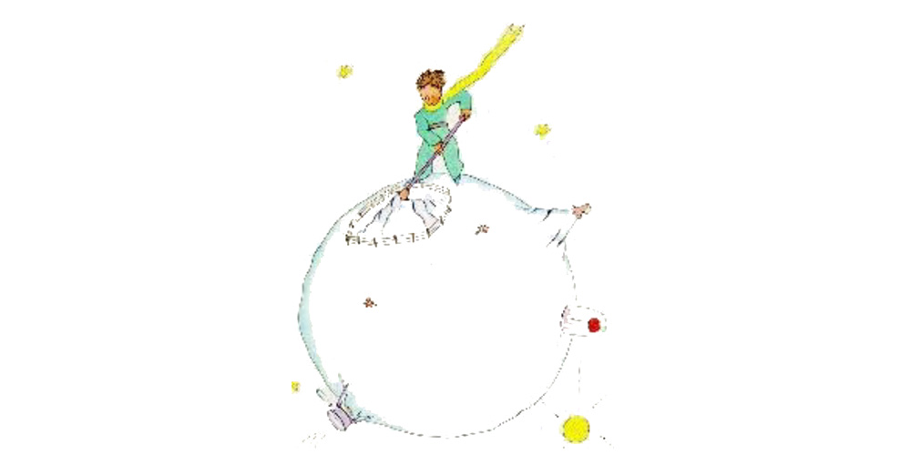

# Chapter 9

I believe that for his escape he took advantage of the migration of a flock of wild birds. On the morning of his departure he put his planet in perfect order. He carefully cleaned out his active volcanoes. He possessed two active volcanoes; and they were very convenient for heating his breakfast in the morning. He also had one volcano that was extinct. But, as he said, "One never knows!" So he cleaned out the extinct volcano, too. If they are well cleaned out, volcanoes burn slowly and steadily, without any eruptions. Volcanic eruptions are like fires in a chimney.

On our earth we are obviously much too small to clean out our volcanoes. That is why they bring no end of trouble upon us.

The little prince also pulled up, with a certain sense of dejection, the last little shoots of the baobabs. He believed that he would never want to return. But on this last morning all these familiar tasks seemed very precious to him. And when he watered the flower for the last time, and prepared to place her under the shelter of her glass globe, he realised that he was very close to tears.

"Goodbye," he said to the flower.

But she made no answer.

"Goodbye," he said again.

The flower coughed. But it was not because she had a cold.

"I have been silly," she said to him, at last. "I ask your forgiveness. Try to be happy..."

He was surprised by this absence of reproaches. He stood there all bewildered, the glass globe held arrested in mid−air. He did not understand this quiet sweetness.

"Of course I love you," the flower said to him. "It is my fault that you have not known it all the while. That is of no importance. But you−− you have been just as foolish as I. Try to be happy... let the glass globe be. I don't want it any more."

"But the wind−−"

"My cold is not so bad as all that... the cool night air will do me good. I am a flower."

"But the animals−−"

"Well, I must endure the presence of two or three caterpillars if I wish to become acquainted with the butterflies. It seems that they are very beautiful. And if not the butterflies−− and the caterpillars−− who will call upon me? You will be far away... as for the large animals−− I am not at all afraid of any of them. I have my claws."

And, naïvely, she showed her four thorns. Then she added:

"Don't linger like this. You have decided to go away. Now go!"

For she did not want him to see her crying. She was such a proud flower...